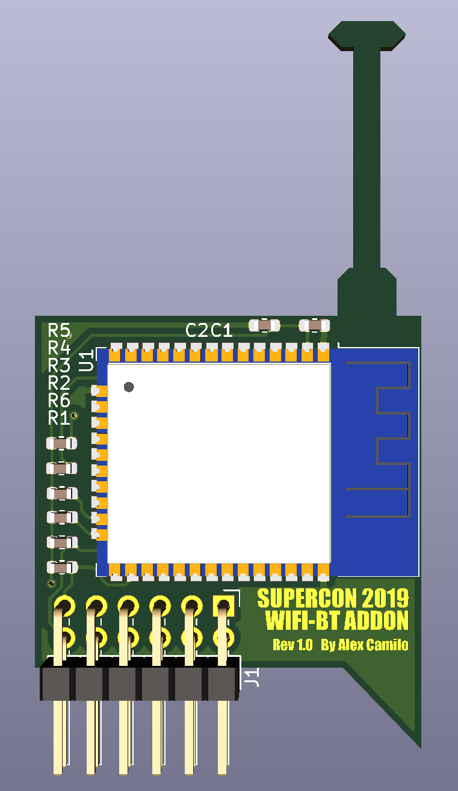

# WifiHat
A hat that connects to the PMOD connector containing a ESP32
* 1-bit SDIO connected to PMOD
* UART and programming pins connected to PMOD
* Will be flashed with esp-at firmware.

# SOC Image
* I have modified the SOC image adding a 3rd UART for the module.
* The pmod pins no. 4 and 5 (B1 B2) are now TX and RX.
* The new UART is at address `0x10000020`

